# PETEMUAN 10 - master_plan

## Praktikum 1: Dasar State dengan Model-View

### Langkah 1: Buat Project Baru

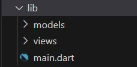

### Langkah 2: Membuat model task.dart

Kelas ini akan menyimpan data tugas untuk aplikasi kita.

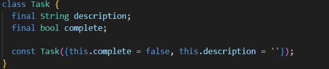

### Langkah 3: Buat file plan.dart

Untuk menyimpan daftar rencana dalam aplikasi to-do ini.

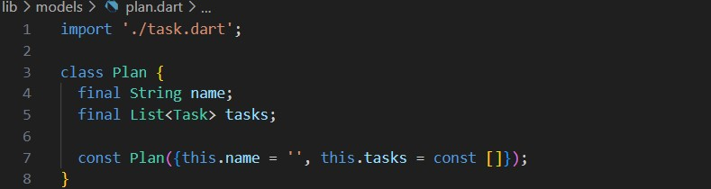

### Langkah 4: Buat file data_layer.dart

Membungkus beberapa data layer ke dalam sebuah file yang nanti akan mengekspor kedua model tersebut. Dengan begitu, proses impor akan lebih ringkas seiring berkembangnya aplikasi.

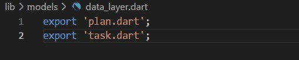

### Langkah 5: Pindah ke file main.dart

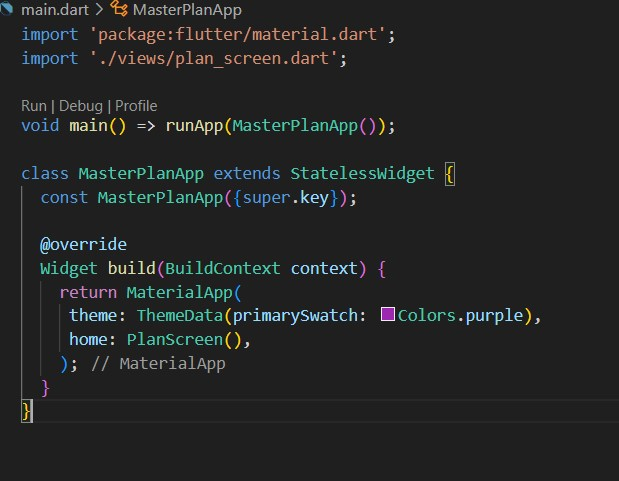

### Langkah 6: buat plan_screen.dart

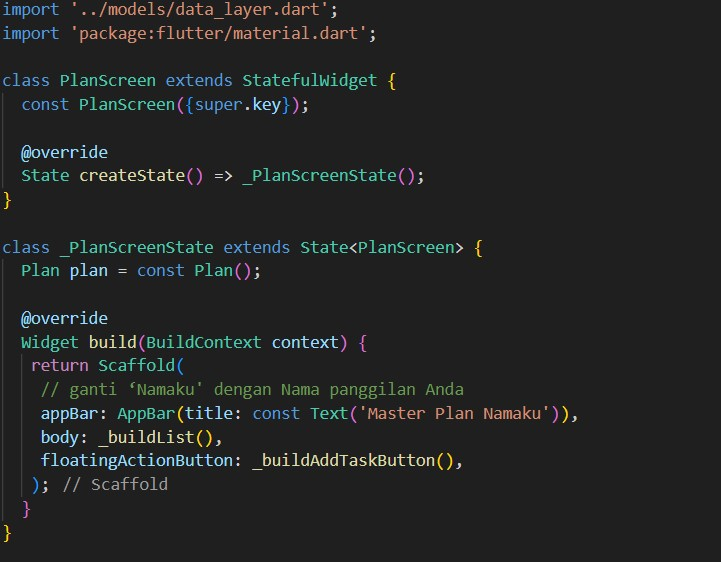

### Langkah 7: buat method \_buildAddTaskButton()

Tombol tambah rencana.

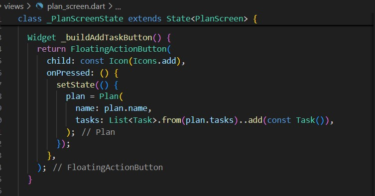

### Langkah 8: buat widget \_buildList()

Membuat widget berupa List yang dapat dilakukan scroll

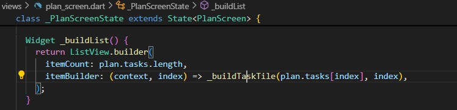

### Langkah 9: buat widget \_buildTaskTile

ListTile untuk menampilkan setiap nilai dari plan.tasks. Kita buat dinamis untuk setiap index data, sehingga membuat view menjadi lebih mudah.

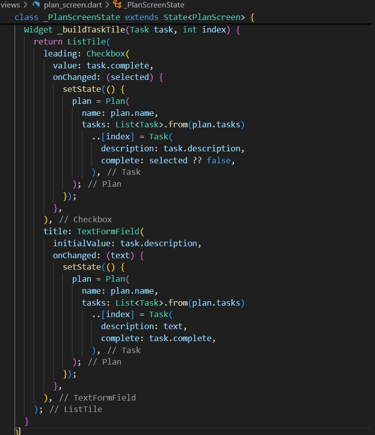

**Hasil Run:**

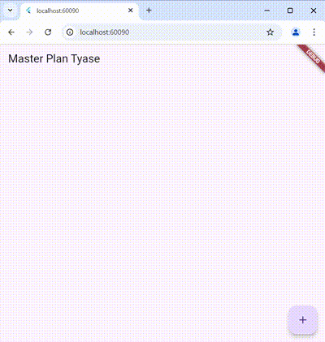

### Langkah 10: Tambah Scroll Controller

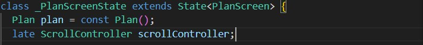

### Langkah 11: Tambah Scroll Listener

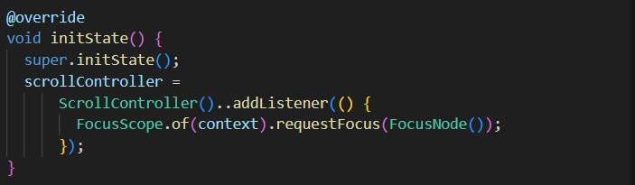

### Langkah 12: Tambah controller dan keyboard behavior

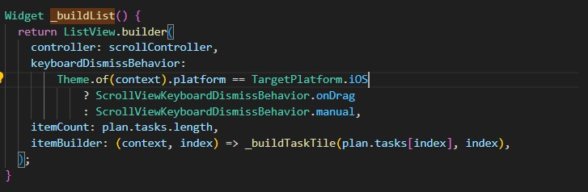

### Langkah 13: Terakhir, tambah method dispose()

Berguna ketika widget sudah tidak digunakan lagi.

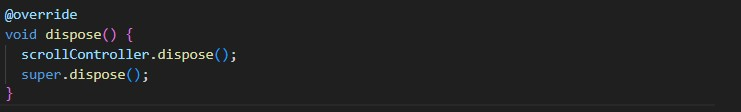

### Langkah 14: Hasil

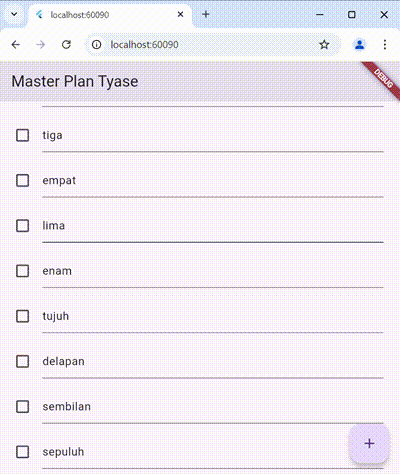

---

## Tugas Praktikum 1: Dasar State dengan Model-View

1. Selesaikan langkah-langkah praktikum tersebut, lalu dokumentasikan berupa GIF hasil akhir praktikum beserta penjelasannya di file README.md! Jika Anda menemukan ada yang error atau tidak berjalan dengan baik, silakan diperbaiki.

2. Jelaskan maksud dari langkah 4 pada praktikum tersebut! Mengapa dilakukan demikian?

   **Jawab:**

   export 'plan.dart';:

   - Perintah ini memberitahukan Dart bahwa plan.dart adalah file yang akan diekspor dan bisa diakses dari file lain yang mengimpor file ini.
   - Dengan menambahkan ekspor seperti ini, file lain yang mengimpor file ini dapat langsung mengakses kelas, fungsi, atau variabel yang ada di dalam plan.dart tanpa perlu mengimpor file tersebut satu per satu.

   export 'task.dart';:

   - Sama seperti sebelumnya, perintah ini mengekspor task.dart, memungkinkan file lain yang mengimpor file ini untuk mengakses isi dari task.dart secara langsung.

3. Mengapa perlu variabel plan di langkah 6 pada praktikum tersebut? Mengapa dibuat konstanta ?

   **Jawab:**

   - plan digunakan untuk memfasilitasi dan mengelola data yang akan ditampilkan di PlanScreen. Dengan menggunakan objek Plan, data yang terkait dengan tampilan rencana ini dapat diakses dan dikelola dalam komponen tampilan, seperti \_buildList() dan \_buildAddTaskButton().

   - const digunakan untuk mendeklarasikan objek yang nilainya tetap selama waktu hidup aplikasi. Dengan menjadikan plan sebagai konstanta, kita memberi tahu Flutter bahwa objek Plan ini tidak akan berubah setelah dibuat.

4. Lakukan capture hasil dari Langkah 9 berupa GIF, kemudian jelaskan apa yang telah Anda buat!

   **Jawab:**

   

   Pada gif terdapat tampilan halaman Master Plan yang dapat kita tambahkan sendiri menggunakan tombol + di pojok kanan bawah, setelahnya kita dapat men-ceklis apa saja yang kita inginkan, untuk lebih lengkapnya anda bisa melihat gif tersebut.

5. Apa kegunaan method pada Langkah 11 dan 13 dalam lifecyle state ?

   **Jawab:**

   - initState() digunakan untuk menginisialisasi sumber daya (seperti ScrollController) atau menambahkan listener saat widget pertama kali dibuat. Pada contoh ini, listener digunakan untuk menghilangkan fokus keyboard saat scroll terjadi.

   - dispose() digunakan untuk membersihkan dan membebaskan sumber daya seperti scrollController yang sudah tidak digunakan lagi, untuk mencegah kebocoran memori dan memastikan pengelolaan memori yang efisien dalam aplikasi.

6. Kumpulkan laporan praktikum Anda berupa link commit atau repository GitHub ke dosen yang telah disepakati !

---

## Praktikum 2: Mengelola Data Layer dengan InheritedWidget dan InheritedNotifier

### Langkah 1: Buat file plan_provider.dart

Kelas ini akan menyimpan data tugas untuk aplikasi kita.

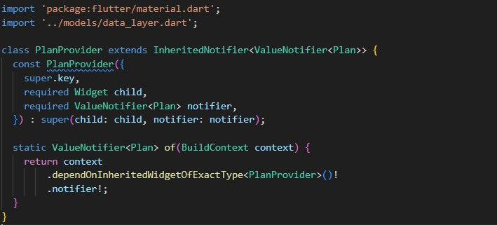

### Langkah 2: Edit main.dart

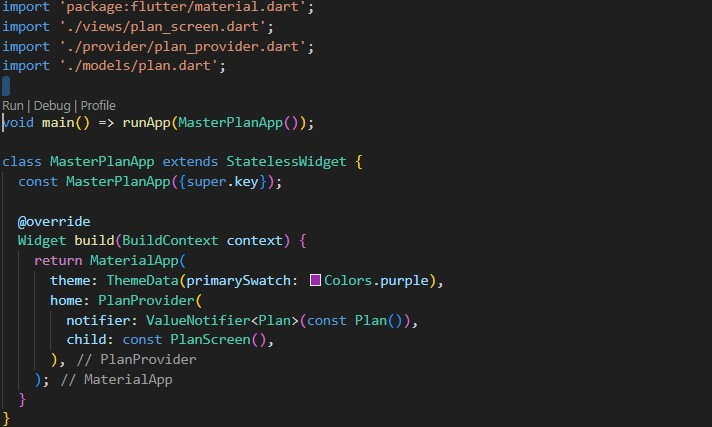

### Langkah 3: Tambah method pada model plan.dart

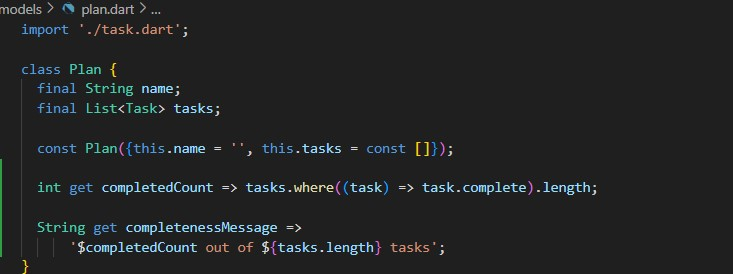

### Langkah 4: Pindah ke PlanScreen

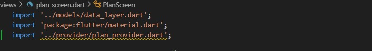

### Langkah 5: Edit method \_buildAddTaskButton

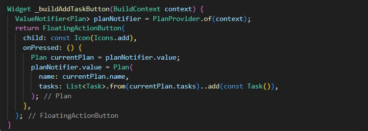

### Langkah 6: Edit method \_buildTaskTile

Parameter BuildContext, gunakan PlanProvider sebagai sumber data.

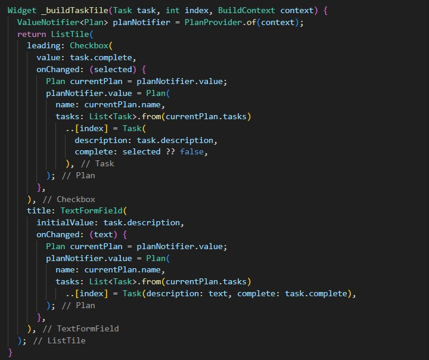

### Langkah 7: Edit \_buildList

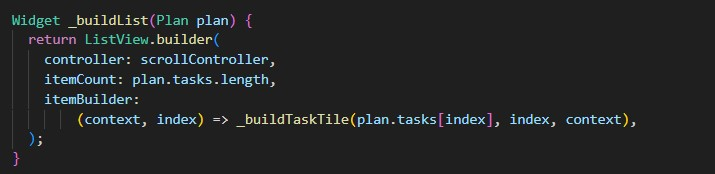

### Langkah 8: Tetap di class PlanScreen

Edit method build sehingga bisa tampil progress pada bagian bawah (footer). Caranya, bungkus (wrap) \_buildList dengan widget Expanded dan masukkan ke dalam widget Column

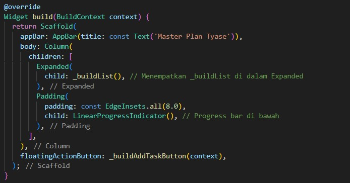

### Langkah 9: Tambah widget SafeArea

---

## Tugas Praktikum 2: InheritedWidget

1. Selesaikan langkah-langkah praktikum tersebut, lalu dokumentasikan berupa GIF hasil akhir praktikum beserta penjelasannya di file README.md! Jika Anda menemukan ada yang error atau tidak berjalan dengan baik, silakan diperbaiki sesuai dengan tujuan aplikasi tersebut dibuat.

2. Jelaskan mana yang dimaksud InheritedWidget pada langkah 1 tersebut! Mengapa yang digunakan InheritedNotifier?

   **Jawab:**

   InheritedWidget adalah sebuah widget di Flutter yang memungkinkan data atau status dari widget tertentu untuk "diturunkan" ke widget-widget anak yang berada di bawahnya dalam tree widget. Widget ini biasanya digunakan untuk menyediakan data yang perlu diakses oleh banyak widget dalam aplikasi, tanpa harus meneruskan data melalui parameter secara eksplisit di setiap widget.

   InheritedNotifier adalah subclass dari InheritedWidget yang bekerja dengan ValueNotifier atau tipe notifier lainnya. InheritedNotifier memudahkan untuk memantau perubahan dalam objek yang digunakan sebagai notifier, seperti ValueNotifier<Plan>. Dibandingkan dengan mengoper status melalui widget individual, InheritedNotifier memberikan cara yang lebih efisien dan terstruktur untuk membagikan dan mengelola state global di seluruh tree widget.

3. Jelaskan maksud dari method di langkah 3 pada praktikum tersebut! Mengapa dilakukan demikian?

   **Jawab:**

   Pada Langkah 3, Anda diminta untuk menambahkan dua method di dalam model class Plan, yaitu completedCount dan completenessMessage.

   - completedCount: Method ini menghitung jumlah tugas yang sudah selesai dalam daftar tugas (tasks). Menggunakan where untuk memfilter hanya tugas yang statusnya complete, dan kemudian menghitung jumlahnya. Method ini berguna untuk menghitung progres tugas-tugas yang sudah diselesaikan, sehingga kita dapat menampilkan informasi tentang berapa banyak tugas yang sudah selesai dibandingkan dengan total tugas.

   - completenessMessage: Method ini menghasilkan pesan yang menginformasikan jumlah tugas yang sudah selesai dibandingkan dengan total tugas. Ini menggabungkan hasil dari completedCount dengan panjang total tugas untuk menghasilkan string yang bisa ditampilkan ke pengguna. Method ini memberikan umpan balik langsung kepada pengguna mengenai status progres mereka, membantu mereka untuk memahami seberapa banyak tugas yang telah diselesaikan.

4. Lakukan capture hasil dari Langkah 9 berupa GIF, kemudian jelaskan apa yang telah Anda buat!

   **Jawab:**

   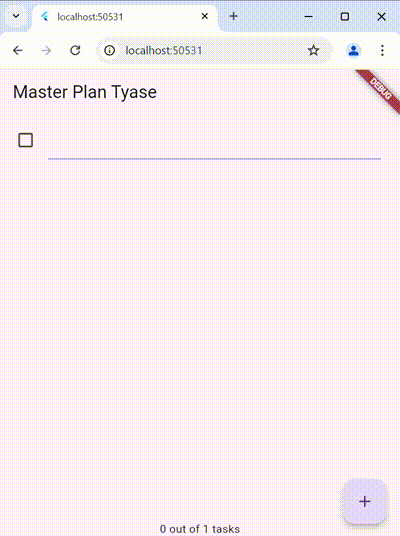

   Sama seperti sebelumnya, menampilkan halaman Master Plan, namun kali ini terdapat perbedaan di bagian bawah tertampil jumlah task (tasks) dan jumlah yang telah di ceklis (out)

5. Kumpulkan laporan praktikum Anda berupa link commit atau repository GitHub ke dosen yang telah disepakati !

---

## Praktikum 3: Membuat State di Multiple Screens

### Langkah 1: Buat file plan_provider.dart

Edit class PlanProvider sehingga dapat menangani List Plan.

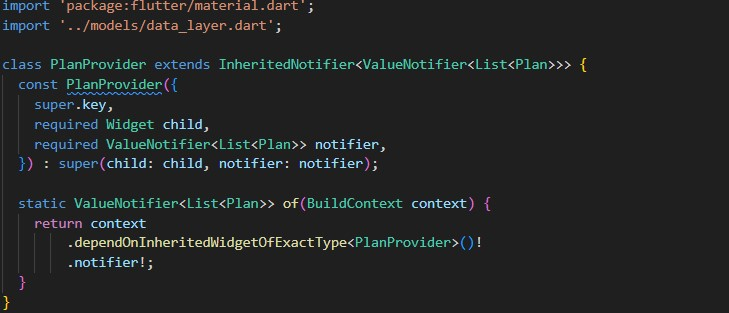

### Langkah 2: Edit main.dart

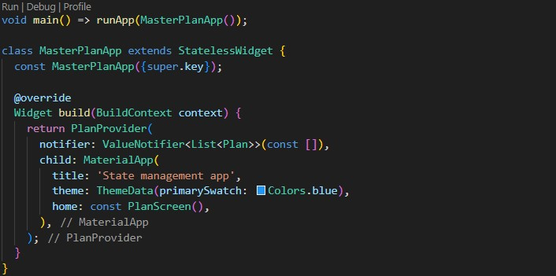

### Langkah 3: Edit plan_screen.dart

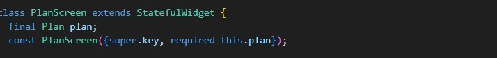

### Langkah 4: Error

Itu akan terjadi error setiap kali memanggil PlanProvider.of(context). Itu terjadi karena screen saat ini hanya menerima tugas-tugas untuk satu kelompok Plan, tapi sekarang PlanProvider menjadi list dari objek plan tersebut.

### Langkah 5: Tambah getter Plan

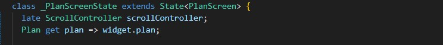

### Langkah 6: Method initState()

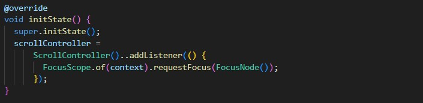

### Langkah 7: Widget build

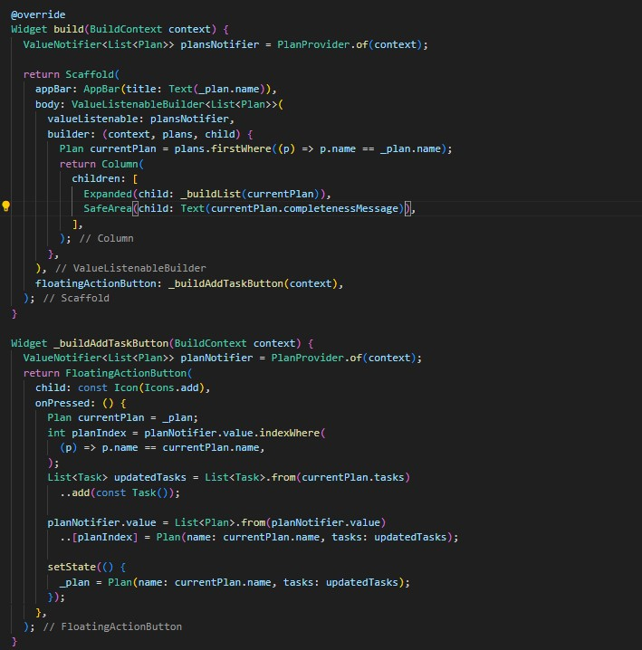

### Langkah 8: Edit \_buildTaskTile

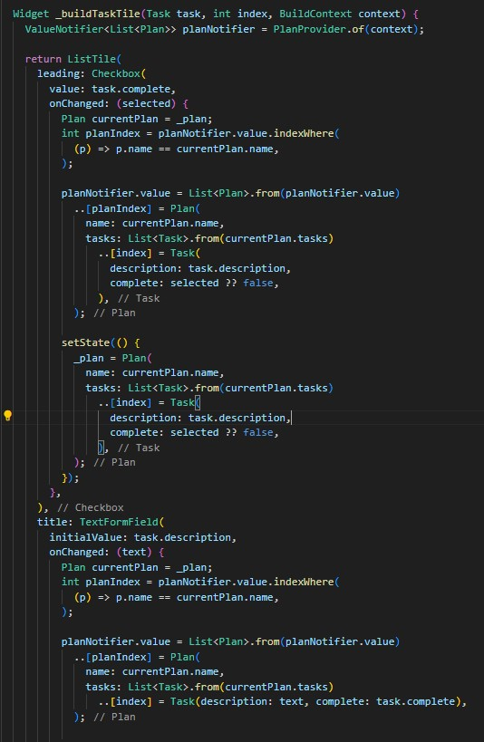

### Langkah 9: Buat screen baru

Pada folder view, buatlah file baru dengan nama plan_creator_screen.dart dan deklarasikan dengan StatefulWidget bernama PlanCreatorScreen. Gantilah di main.dart pada atribut home menjadi seperti berikut.

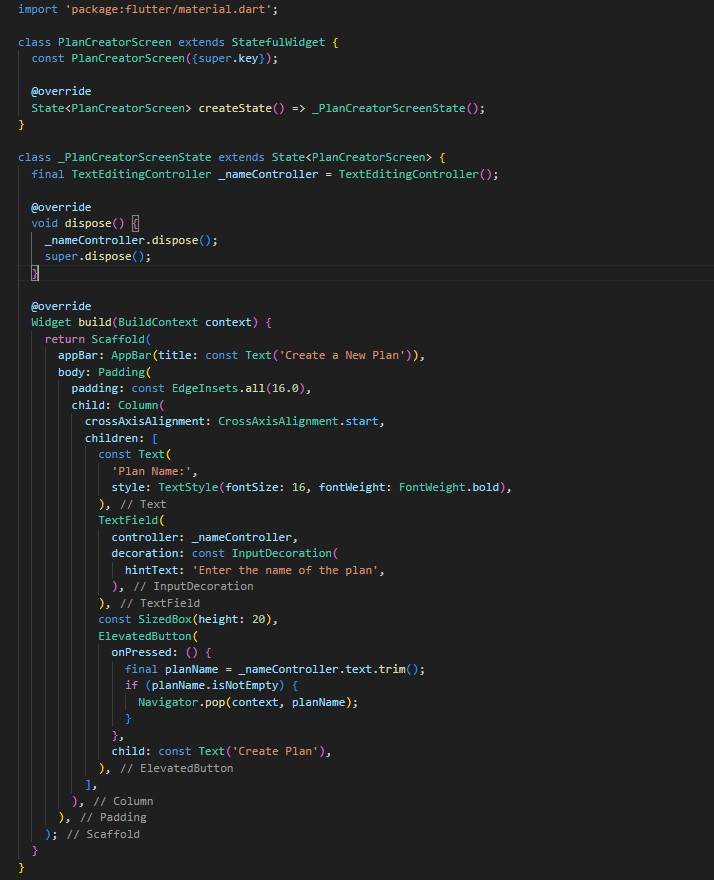

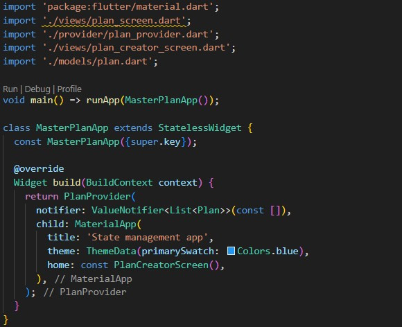

### Langkah 10: Pindah ke class \_PlanCreatorScreenState

Kita perlu tambahkan variabel TextEditingController sehingga bisa membuat TextField sederhana untuk menambah Plan baru. Jangan lupa tambahkan dispose ketika widget unmounted seperti kode berikut.

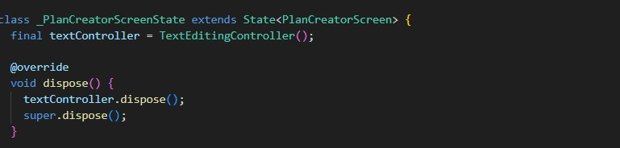

### Langkah 11: Pindah ke method build

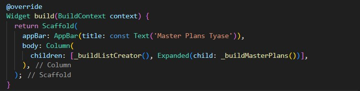

### Langkah 12: Buat widget \_buildListCreator

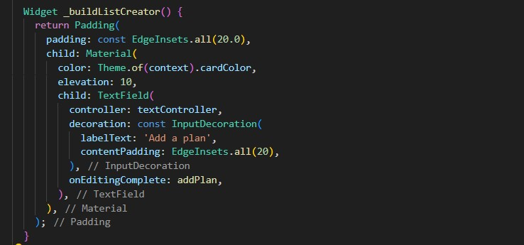

### Langkah 13: Buat void addPlan()

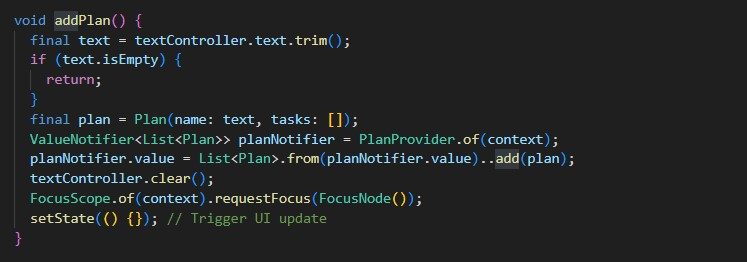

### Langkah 14: Buat widget \_buildMasterPlans()

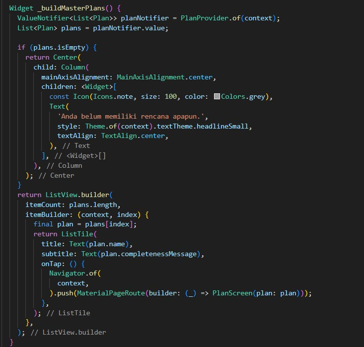

---

## Tugas Praktikum 3: State di Multiple Screens

1. Selesaikan langkah-langkah praktikum tersebut, lalu dokumentasikan berupa GIF hasil akhir praktikum beserta penjelasannya di file README.md! Jika Anda menemukan ada yang error atau tidak berjalan dengan baik, silakan diperbaiki sesuai dengan tujuan aplikasi tersebut dibuat.

2. Berdasarkan Praktikum 3 yang telah Anda lakukan, jelaskan maksud dari gambar diagram berikut ini!

   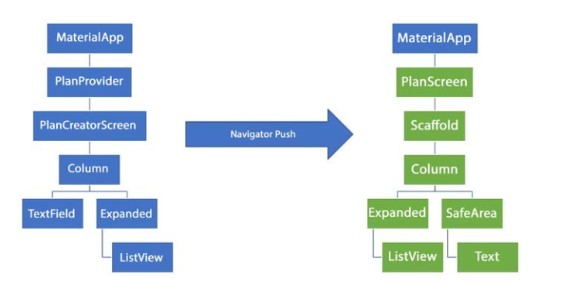

   **Jawab:**

   **Diagram Kiri:**

   - MaterialApp:

     Ini adalah root dari aplikasi Flutter yang digunakan untuk menyediakan struktur aplikasi, seperti tema dan rute.

   - PlanProvider:

     Sebuah widget yang menggunakan state management berbasis InheritedNotifier untuk membagikan data Plan (rencana) ke seluruh widget di bawahnya.

   - PlanCreatorScreen:

     Layar utama yang menampilkan form input (TextField) untuk menambahkan rencana baru. Layout-nya menggunakan:

     Column: Sebagai container untuk widget lainnya.

     TextField: Untuk memasukkan nama rencana baru.

     Expanded: Mengisi ruang yang tersisa di layar, biasanya digunakan bersama widget seperti ListView.

     ListView: Menampilkan daftar rencana yang telah dibuat.

   **Diagram Kanan:**

   - Navigator Push:

     Ketika pengguna memilih salah satu rencana dari daftar, aplikasi akan menggunakan Navigator.push() untuk berpindah ke layar baru yang disebut PlanScreen.

   - PlanScreen:

     Layar ini menampilkan detail dari rencana yang dipilih. Layout-nya menggunakan:

     Scaffold: Sebagai kerangka utama layar, termasuk AppBar dan body.

     Column: Untuk menyusun widget di layar secara vertikal.

     Expanded: Digunakan untuk menampilkan ListView, memastikan bahwa daftar tugas (tasks) dapat bergulir.

     SafeArea: Menjaga konten tidak tumpang tindih dengan elemen sistem seperti status bar.

     Text: Menampilkan pesan tentang progres atau jumlah tugas yang sudah selesai.

3. Lakukan capture hasil dari Langkah 14 berupa GIF, kemudian jelaskan apa yang telah Anda buat!

   **Jawab:**

   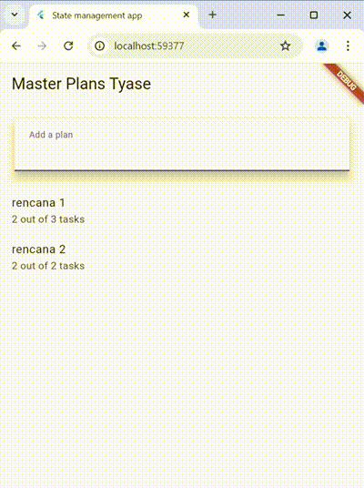

   Kode ini akan menampilkan halaman Master Plan Tyase yang berisi TextField untuk memasukkan nama rencana baru, lalu apabila selesai, maka akan tertampil pada daftar rencana yang sudah dibuat. Daftar rencana ini dapat di klik untuk menampilkan detail dari rencana yang sudah dibuat. Pada bagian daftar rencana terdapat pesan di bagian bawah seperti "2 out of 3 tasks".

4. Kumpulkan laporan praktikum Anda berupa link commit atau repository GitHub ke dosen yang telah disepakati !
